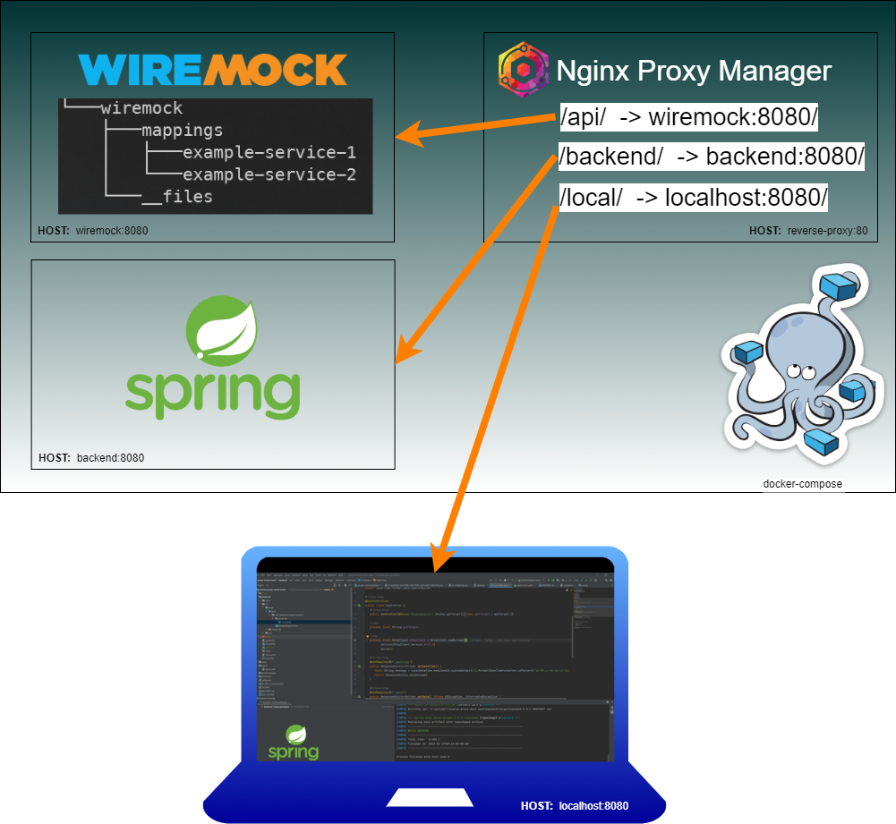
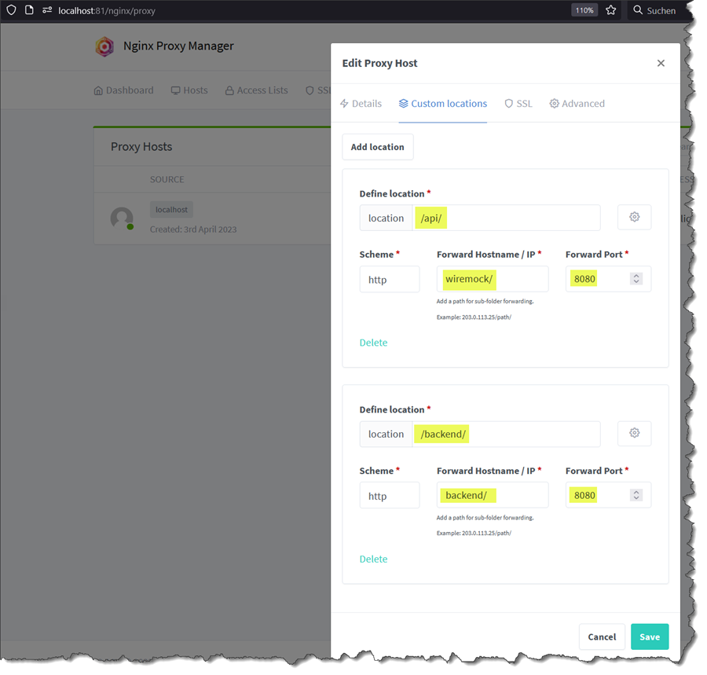
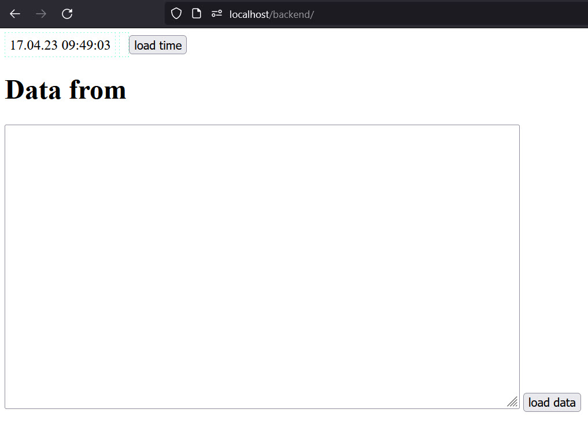

# reverse-proxy-mock-mesh
An example for mock-reverse-proxy scenario



# Run screnario
````shell
$ cd backend
$ ./mvnw clean package
$ cd..
$ docker-compose up
````

# Open Proxymanager
[open "Login – Nginx Proxy Manager" after startup](http://localhost:81/login)

|      | Value           |
|------|-----------------|
| User | admin@admin.com |
| Pass | password123     |



## Test java backend
```shell
$ curl localhost/backend/datetime
```

```shell
$ curl localhost/backend/data
```
[http://localhost/backend/](http://localhost/backend/)


## Test Wiremock
````shell
$ curl localhost/api/example-1/test
````